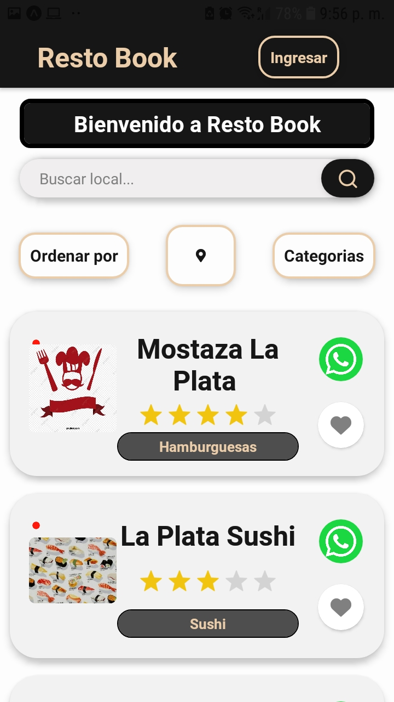
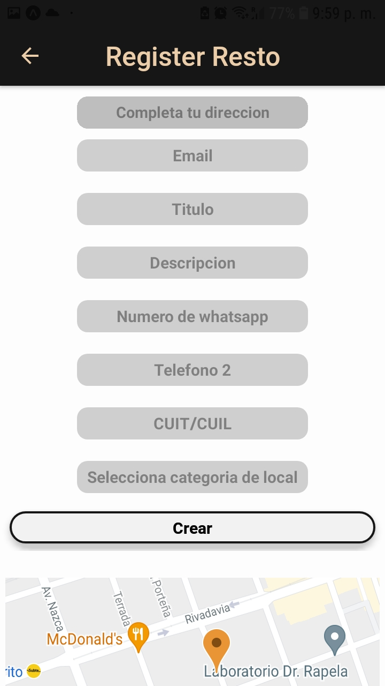
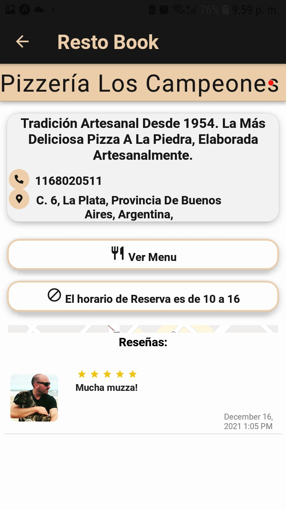
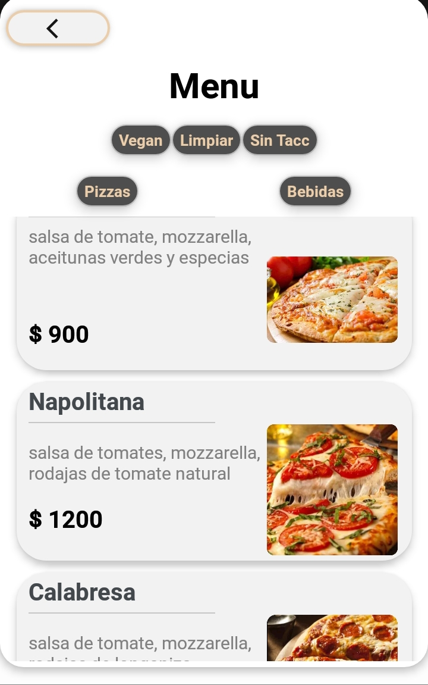
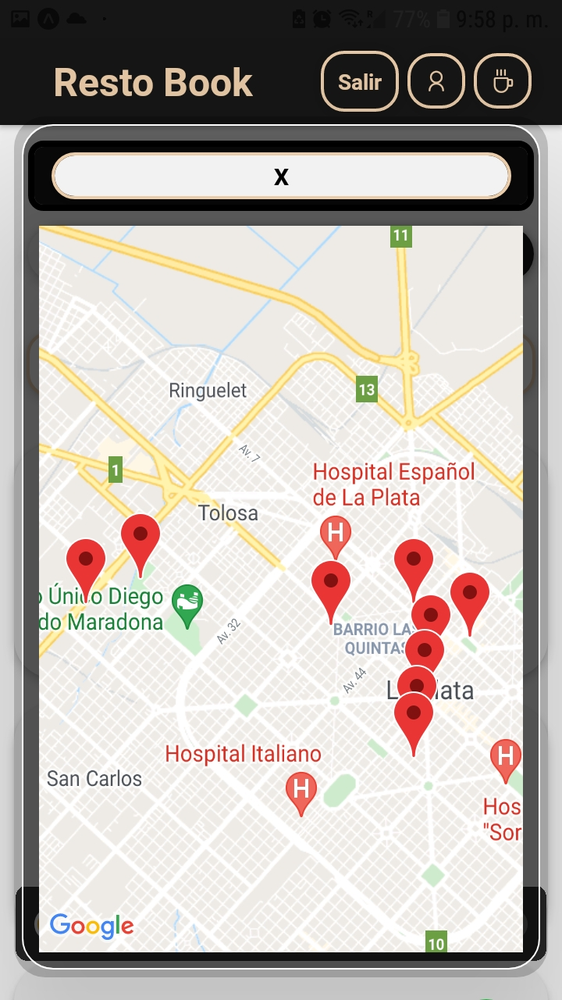
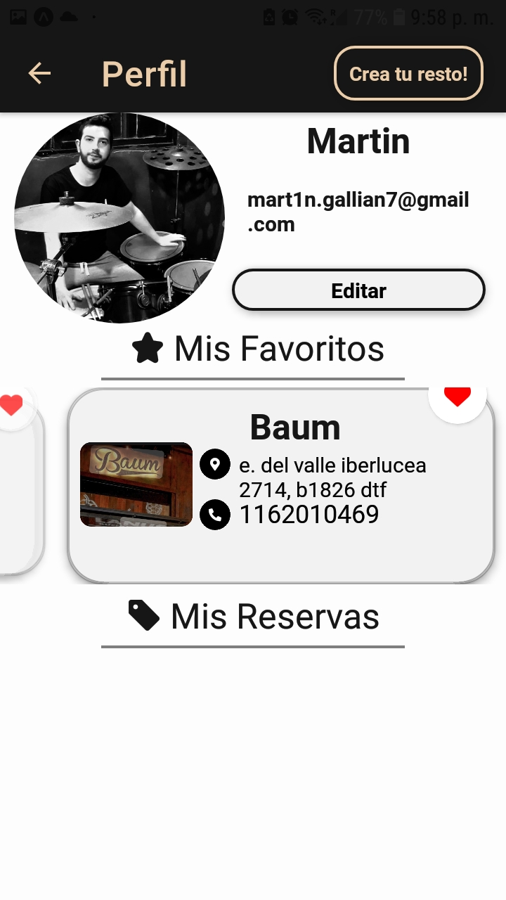

  <kbd>
                                                                                      
</kbd>
    

    
<h1 align='center'> 👋 Hi and welcome to my github :blush: </h1>

 
#### ABOUT

Full stack developer and math teacher, I have many skills
important to effectively perform various tasks. Among them, the most
important and that I personally highlight, is that I learn quickly, I am curious,
versatile but not for that inconsistent. I think that something that defines me the most is
constancy in terms of problem solving.

#  
#### Languages and Tools:
 

 
 
 

 

 

# 
## :briefcase: My proyects:

  <kbd>
     
      
      
</kbd>
    

<kbd> 
                
           
           
       </kbd>
  

  

  <kbd> 
              
       
       
  </kbd>

# 

### :paperclip: contact me:

 

<!---
MartinGalliano/MartinGalliano is a ✨ special ✨ repository because its `README.md` (this file) appears on your GitHub profile.
You can click the Preview link to take a look at your changes.
--->
